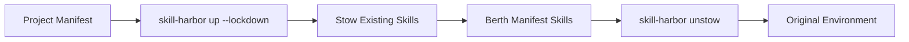

# 🛡️ Governance & Lockdown

In a professional development environment, ensuring that your AI agent is operating with the correct set of specialized skills—and *only* those skills—is critical for security, performance, and reproducibility.

Skill Harbor provides a robust governance system that allows you to isolate your agent's context using **Lockdown Mode**, **Stowage**, and **Unstowing**.

## ⚓ The Governance Lifecycle



---

## 🔒 Lockdown Mode (`--lockdown`)

When you run `skill-harbor up --lockdown`, Harbor treats your `harbor-manifest.json` as the **exclusive** source of truth. Any existing skills in your agent's configuration folders that are *not* defined in the manifest are moved into a secure backup location (Stowage).

### Why use Lockdown?
- **Client Confidentiality**: Switching from a personal project to a client project with strict rules.
- **Reproducibility**: Ensuring every developer on a team has the exact same context for a specific task.
- **Security**: Preventing agents from accidentally using unvetted or "ghost" skills in a sensitive repository.

```bash
# Sync and enforce a manifest-only environment
skill-harbor up --lockdown
```

---

## 📦 Stowage & Unstowing

If you need a clean slate for a limited time but don't want to permanently delete your existing skills, you can use the `stow` and `unstow` commands.

### `skill-harbor stow`
Moves all current skills in your agent's directory into the Skill Harbor metadata folder (`.harbor/stowage`). This effectively "clears the deck" for a fresh session.

### `skill-harbor unstow`
The "Unlock" command. It restores your previously stowed skills, merging them back into your agent's active configuration. This is typically run after you've finished a lockdown session.

```bash
# Manually back up current skills
skill-harbor stow

# Restore stowed skills
skill-harbor unstow
```

---

## ⚓ Why Use Governance?

1.  **Consistency**: One developer adding a 10,000-token skill can ruin the token economy for the whole team. Lockdown prevents this.
2.  **Context Hygiene**: Agents perform better when their context is "right-sized." Governance helps you keep the "displacement" (token usage) low.
3.  **Auditability**: By using a declarative manifest and --lockdown, you can audit exactly what logic was available to an agent during any specific development phase.

```bash
# Combining global and local governance
skill-harbor up --global --lockdown
```
