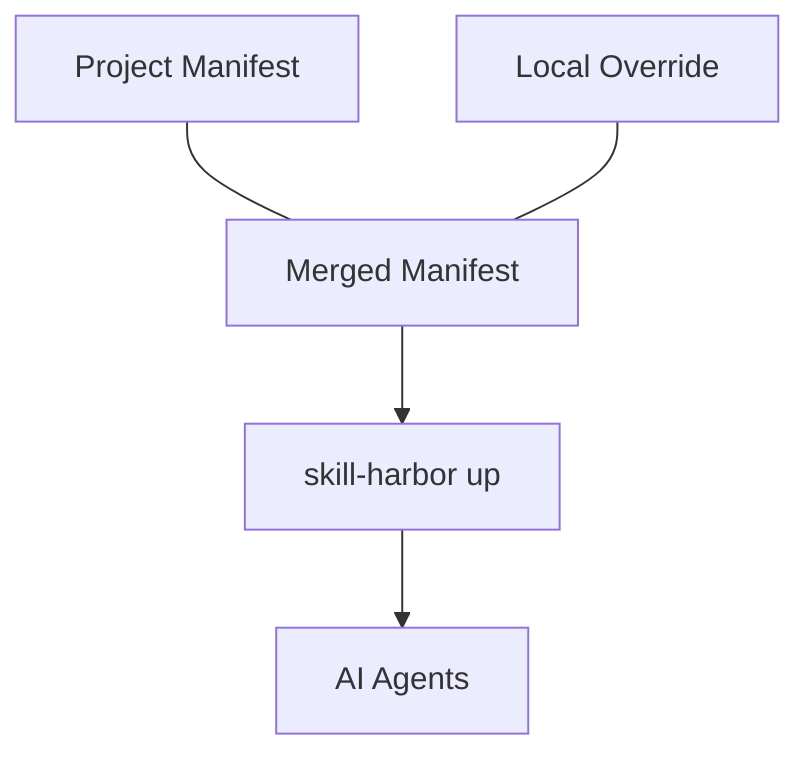

# 📖 The Manifest & .harbor Folder

Skill Harbor manages your fleet of agent skills via a **Declarative Control System**. This system is powered by two main components: the `harbor-manifest.json` file and the hidden `.harbor/` folder in your project or home directory.

The manifest identifies which skills to pull and how to track them, while the `.harbor/` folder provides the infrastructure for caching, versioning, and environment isolation.

---

## ⚓ The Dual Manifest Architecture

Skill Harbor recognizes two distinct levels of orchestration:

### 1. Project Manifest (`.harbor/harbor-manifest.json`)
This is the **shared configuration** for a specific repository. It defines the skills every developer on your team needs to have berthed to their respective agents.

### 2. Local Override (`.harbor/harbor-manifest.local.json`)
This allows you to add your **personal skills** or override specific versions of team skills without polluting the main repository. This file is automatically ignored by Git.



---

## 🏗️ The `.harbor/` Folder Structure

Skill Harbor keeps all its internal control files and cached "cargo" in the `.harbor/` directory.

<AccordionGroup>
  <Accordion title=".harbor/skills/">
    **The Cargo Cache**. This is where raw skill repositories are fetched and stored. Skill Harbor uses a hashing mechanism to compare the state of your cache with the remote source.
  </Accordion>
  <Accordion title=".harbor/stowage/">
    **The Secure Backup**. When you run in **Lockdown Mode** (`--lockdown`), any skills in your agent folders that aren't defined in your manifest are moved here. This ensures a clean, auditable environment without deleting your personal rule-sets.
  </Accordion>
  <Accordion title=".harbor/hooks/">
    **Automation Scripts**. Contains custom logic for transpiling and validating skills during the `up` process.
  </Accordion>
</AccordionGroup>

---

## ⚙️ How Skills are Managed (Control)

Skill Harbor does more than just copy files; it ensures your agent environment is deterministic and auditable.

### 1. Cryptographic Tracking
Every skill entry in the manifest contains a `lastSyncHash`. This hash is a composite of the source URL and the file system state. If a remote skill is updated (or a local file is modified), Harbor detects the drift and prompts for a `freshen` or automatic sync.

### 2. Zero-Tier Discovery
Upon every successful sync (`up`), Skill Harbor generates a **Master Fleet Manifest** (`000-fleet-intelligence.md`) and berths it directly into your agent configuration. This manifest allows agents to discover and route to all berthed skills even if they don't have native multi-tool indexing support.

### 3. Lockdown Governance
By using the `--lockdown` flag, you force your environment to mirror the manifest **exactly**. This is the highest level of control, ideal for production-sensitive repositories or client-facing projects with strict security requirements.

```bash
# Sync and enforce the manifest-only environment
skill-harbor up --lockdown
```
