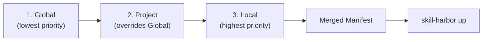

# 📖 The Manifest & .harbor Folder

Skill Harbor manages your fleet of agent skills via a **Declarative Control System**. This system is powered by two main components: the `harbor-manifest.json` file and the hidden `.harbor/` folder in your project or home directory.

The manifest identifies which skills to pull and how to track them, while the `.harbor/` folder provides the infrastructure for caching, versioning, and environment isolation.

---

## ⚓ The Three-Layer Manifest Architecture

Skill Harbor merges three manifest layers into a single resolved view every time you run `up`, `fathom`, or any command that reads the manifest. Later layers override earlier ones.

Before going deeper, keep one distinction clear:

- **Source** = where a skill comes from
- **Target** = where Harbor generates/berths it to

For the full mental model, see [Sources & Targets](/docs/foundations/sources-and-targets).

### 1. Global Manifest (`~/.harbor/harbor-manifest.json`)
Your **personal fleet** — skills that follow you across every project on your machine. Registered with `skill-harbor dock <source> --global` and synced with `skill-harbor up --global`. See [Global Fleet](/docs/foundations/global-fleet) for details.

### 2. Project Manifest (`.harbor/harbor-manifest.json`)
The **shared team configuration** for a specific repository. Committed to Git so every developer gets the same skills. Overrides any Global skill with the same name.

### 3. Overrides Manifest (`.harbor/harbor-manifest.overrides.json`)
Your **personal overrides** for this specific project — swap a skill version, add a debugging tool, or test a branch without affecting teammates. This file is automatically ignored by Git. Overrides both Project and Global skills with the same name.

### Merge Priority



When a skill name exists in multiple layers, the highest-priority layer wins. Overridden skills are flagged in the `up` output:

```
⚠️  Overrides Active: The following skills are being overridden by personal definitions:
   - my-skill
```

Targets (agent platforms) are merged as a union across all three layers.

---

## 🏗️ The `.harbor/` Folder Structure

Skill Harbor keeps all its internal control files and cached "cargo" in the `.harbor/` directory.

<AccordionGroup>
  <Accordion title=".harbor/skills/">
    **The Cargo Cache**. This is where raw skill repositories are fetched and stored. Skill Harbor uses a hashing mechanism to compare the state of your cache with the remote source.
  </Accordion>
  <Accordion title=".harbor/stowage/">
    **The Secure Backup**. When you run in **Lockdown Mode** (`--lockdown`), any skills in your agent folders that aren't defined in your manifest are moved here. This ensures a clean, auditable environment without deleting your personal rule-sets.
  </Accordion>
  <Accordion title=".harbor/hooks/">
    **Automation Scripts**. Contains custom logic for transpiling and validating skills during the `up` process.
  </Accordion>
</AccordionGroup>

---

## ⚙️ How Skills are Managed (Control)

Skill Harbor does more than just copy files; it ensures your agent environment is deterministic and auditable.

### 1. Cryptographic Tracking
Every skill entry in the manifest contains a `lastSyncHash`. This hash is a composite of the source URL and the file system state. If a remote skill is updated (or a local file is modified), Harbor detects the drift and prompts for a `freshen` or automatic sync.

### 2. Zero-Tier Discovery
Upon every successful sync (`up`), Skill Harbor generates a **Master Fleet Manifest** (`000-fleet-intelligence.md`) and berths it directly into your agent configuration. This manifest allows agents to discover and route to all berthed skills even if they don't have native multi-tool indexing support.

### 3. Lockdown Governance
By using the `--lockdown` flag, you force your environment to mirror the manifest **exactly**. This is the highest level of control, ideal for production-sensitive repositories or client-facing projects with strict security requirements.

```bash
# Sync and enforce the manifest-only environment
skill-harbor up --lockdown
```

---

## 🚀 Migrating from Root-Level Manifests

Earlier versions of Skill Harbor stored `harbor-manifest.json` at the project root. The current standard consolidates everything under `.harbor/` for consistency with the broader AI tooling ecosystem (`.claude/`, `.cursor/`, `.github/`).

If Skill Harbor detects a root-level manifest during `up`, it will display a recommendation:

```
💡 Recommendation: Found harbor-manifest.json at project root.
   Run 'skill-harbor migrate' or 'skill-harbor up --migrate' to automate the transition.
```

### What `migrate` does

The migration engine interactively walks through three steps:

1. **Manifest relocation** — Moves `harbor-manifest.json` into `.harbor/` and renames any legacy `harbor-manifest.local.json` file to `.harbor/harbor-manifest.overrides.json`.
2. **Skills cache reorganization** — Moves loose skill directories from `.harbor/` into `.harbor/skills/` so that cache and config are cleanly separated.
3. **Gitignore update** — Replaces a blanket `.harbor/` ignore with granular rules so your manifest and hooks can be committed while the cache stays ignored.

```bash
# Run the interactive migration
skill-harbor migrate

# Or trigger it during a sync
skill-harbor up --migrate
```

<Warning>
Moving the manifest is a **breaking change** for teammates still on the old layout. Coordinate the migration with your team and ensure everyone runs `migrate` or pulls the updated `.harbor/` structure.
</Warning>
