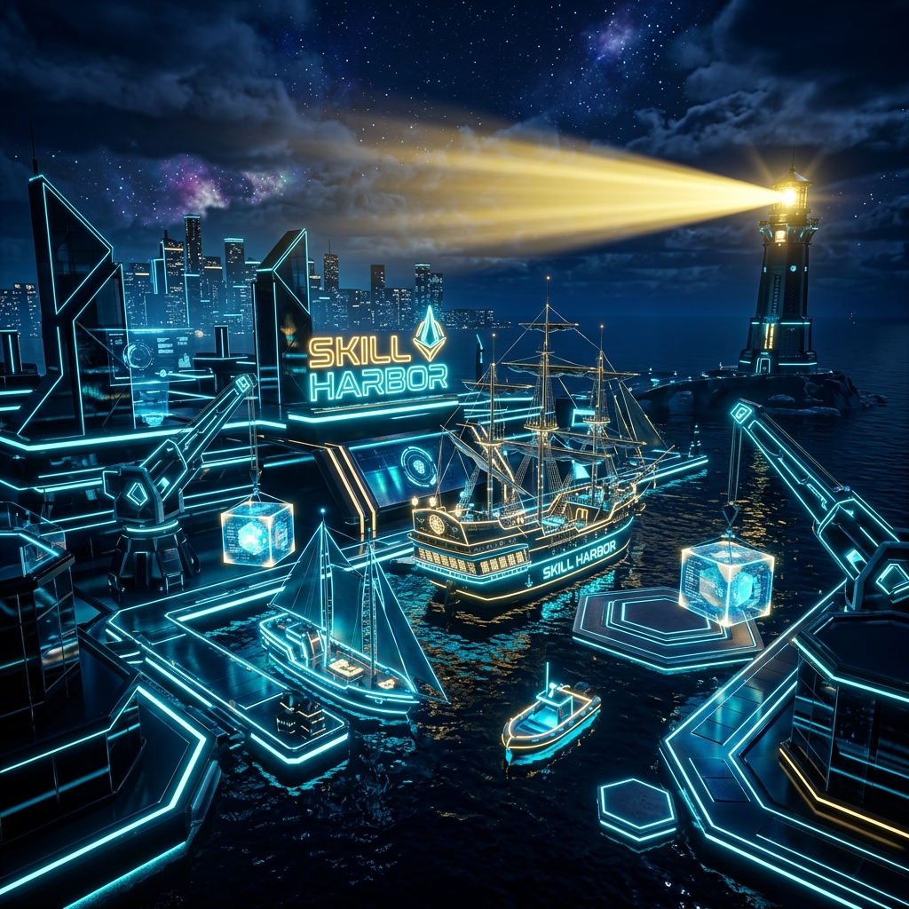
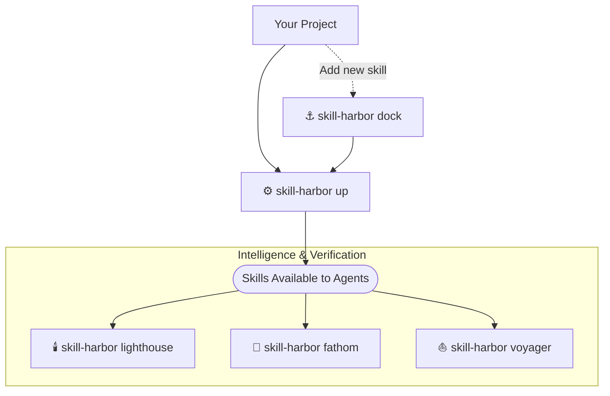

# ⚓ Skill Harbor ⚓

Instead of manual skill installation or fragile global configurations, Skill Harbor uses a declarative manifest to manage your team's "Collective Intelligence." It enables individuals and teams to **gain deep insights** into their skills, **hone** them for specific projects, and **orchestrate** their distribution seamlessly.

**It is the intelligence infrastructure layer for professional development workflows.**

<CardGroup cols={2}>
  <Card title="🧭 Manifest-First" icon="book-open" href="/docs/foundations/manifest">
    Skill Harbor is driven by a committed `.harbor/harbor-manifest.json` that defines which skills your project manages and where they should be berthed.
  </Card>
  <Card title="⚓ Dock + Up" icon="anchor" href="/docs/quickstart">
    `skill-harbor dock` registers a skill source. `skill-harbor up` is the core engine that fetches sources, runs target-specific adaptation, and berths skills into agent folders.
  </Card>
  <Card title="🛳️ Multi-Target Berthing" icon="ship">
    During `skill-harbor up`, one manifest can deploy consistent skill context to Claude, Cursor, Codex, Gemini, Windsurf, Copilot, and other supported targets.
  </Card>
  <Card title="🛡️ Governance Controls" icon="shield" href="/docs/reference/commands">
    Use `up --lockdown`, `stow`, `unstow`, `undock`, and `migrate` to control what agents can see and to safely manage state over time.
  </Card>
  <Card title="📏 Analysis + Verification" icon="chart-bar" href="/docs/foundations/fathom">
    `fathom` audits token load, contracts, and ghost skills. `voyager` simulates agent workflows. `check` validates berthed skill metadata.
  </Card>
  <Card title="🕯️ Agent Discovery" icon="lighthouse">
    `lighthouse` generates a fleet-intelligence snippet for agents that do not natively discover berthed skills on their own.
  </Card>
</CardGroup>


## 🏗️ The Harbor Workflow

Basic Workflow


## 🏆 Skill Standards

At the heart of the harbor is the **[Skill Standard](/docs/skill-standards)**. We believe that AI context shouldn't be a "black box." Every skill in your fleet follows a strict anatomy centered on:

- **Strategic Headers**: `Purpose`, `Trigger`, and `Guidelines` for deterministic routing.
- **Semantic Contracts**: Optional `Requires` and `Produces` keys to allow for safe skill chaining.
- **Displacement Math**: Automated token counting to keep your "context wake" small.


## 🧠 The Necessity of Curated Registries

Empirical research suggests that LLMs cannot reliably self-generate procedural knowledge on the fly. In the SkillsBench evaluation, self-generated skills produced negligible or negative benefit on average. Skill Harbor addresses that failure mode by providing a vetted catalog of strategic skills, making a curated registry a safer operating model for reliable agent success.

If you want the deeper comparison, see the FAQ entry: **[How does Skill Harbor align with SkillsBench?](/docs/faq/skillsbench)**.

## 🔍 What This Looks Like in Practice

A new developer joins your team. Without Skill Harbor, they spend time manually copying prompt files into `.claude/skills/`, hoping they grabbed the right versions, and have no idea which skills their teammates are using.

With Skill Harbor, they clone the repo and run one command:

```bash
skill-harbor up
```

That single command reads the committed `.harbor/harbor-manifest.json`, fetches the latest versions of every skill, adapts them for each agent platform (Claude, Cursor, Codex), and berths them into the right configuration folders. Every developer on the team now has identical agent context.

Later, a tech lead wants to verify the fleet before merging a PR that adds a new skill:

```bash
# Does the new skill bloat the context window?
skill-harbor fathom --report --max-tokens 15000

# Do the I/O contracts between skills still align?
skill-harbor fathom --contracts

# Does the agent actually use the right tools for this query?
skill-harbor voyager -f harbor-voyager-test.yaml
```

If any check fails, the process exits with code 1 — ready to block CI.

---

## ⚓ Why You & Your Team Benefit

Skill Harbor is built for the **Solo Captain** and the **Full Fleet Command**.

### 🚢 For Teams (Fleet Command)
- **The Synced Brain**: Commit a `harbor-manifest.json` once, and every developer gets the same specialized skills and context instantly. No more "Works on my machine" agent behavior.
- **Collaborative Governance**: Enforce strict `--lockdown` rules and semantic contract validation across your entire repository.
- **Atomic Standardization**: Ensure all agents (Claude, Cursor, Codex, Antigravity) are playing by the same set of maritime rules.

### 🚣 For Individuals (Solo Captains)
- **Skill Honing**: Use the **Loft Master** and **Fleet Surgeon** to right-size and refactor your personal skills for maximum performance.
- **Context Insights**: Understand exactly how much "displacement" (tokens) your skills are consuming and avoid reasoning degradation.
- **Global Fleet**: Manage a persistent user-level manifest to sync your personal brand of intelligence across every project you touch.

---

## ✨ Features at a Glance

- **🚣 Insights & Refinement**: Mathematically audit your intelligence layer for token bloat and semantic collisions with **Fathom**.
- **🚢 Enterprise Skill Sync Engine**: Standardize AI context rules for your entire repo.
- **🏗️ Multi-Platform Support**: Automatic distribution to **Claude Code**, **Cursor**, **Codex**, and **Antigravity**.
- **⚡ Parallel Synchronization**: Sync your entire fleet of skills concurrently for maximum performance.
- **🌍 Global Fleet Control**: Manage personal and organization-wide skills across any project workspace.
- **🛠️ Cross-Platform Transpilation**: Powered by `skill-porter` to convert skill formats between Gemini and Claude seamlessly.
- **🔌 Idempotent**: Run `skill-harbor up` safely to pull down the latest adapted skill updates.

---

## ❓ Related FAQ

- **[How does Skill Harbor align with SkillsBench?](/docs/faq/skillsbench)**
- **[Why Not Skills.sh?](/docs/faq/comparison)**

---

*Reference: Li, X., et al. (2026). SkillsBench: Benchmarking How Well Agent Skills Work Across Diverse Tasks. https://www.skillsbench.ai/skillsbench.pdf*
